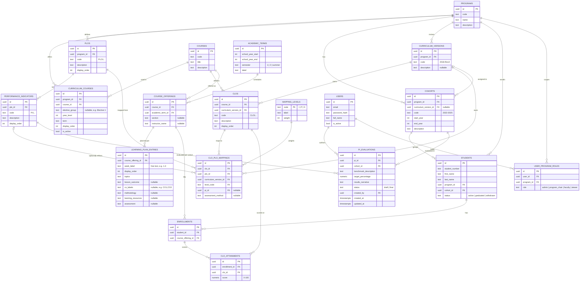

# CQI Data Model

Source data audited from `docs/source-data/Program Assessment and Evaluation (by
Courses and Students) CLO to PLO Version.xlsx` (BSCS, batch 2022–2025, 99 students,
28 courses × 3 CLOs each, 11 PLOs). The workbook mixes true source data with derived
rollups computed by spreadsheet formulas; this schema stores only the source data and
recomputes rollups as SQL views, so there is exactly one place each fact can be wrong.

## Mapping workbook sheets → schema

| Sheet | Nature | Schema equivalent |
|---|---|---|
| `CLO_Attainments` | raw fact | `clo_attainments` table |
| `Mapping` | raw fact (CLO→PLO, I/P/D) | `clo_plo_mappings` table |
| `MapWeight` | static lookup, not real data | `mapping_levels` seed table (I=1, P=2, D=3) |
| `PLO Attainment by Courses` | derived | `v_plo_attainment_by_course` view |
| `PLO Attainment by Students` | derived | `v_plo_attainment_by_student` view |
| `PLO Attainment Evaluation` | narrative, faculty-entered | `pi_evaluations` table |

## Entity-relationship diagram

## Table notes

### Catalog (institution-wide, program-independent)

- **`courses`** is a global catalog, not owned by a program — the same course code
  (e.g. `CCC100`) can be part of multiple programs' curricula. `curriculum_courses`
  is the join that puts a course into a specific program's curriculum, carrying the
  "Elective N" slot label from the workbook (`elective_group`) so an elective slot's
  chosen course can change between curriculum revisions without altering history.
- **`mapping_levels`** seeds exactly three rows (`I`/1, `P`/2, `D`/3), replacing the
  `MapWeight` sheet. Because it's a lookup joined at query time, changing a weighting
  scheme later doesn't require rewriting historical mapping data.
- **`academic_terms`** exists for real record-keeping (which semester a course was
  offered) even though the source workbook aggregates by batch only.

### Program structure

- **`plos`** and **`performance_indicators`** are scoped per program
  (`UNIQUE(program_id, code)` / `UNIQUE(plo_id, code)`) since PLO/PI numbering restarts
  per program.
- **`curriculum_versions`** models a curriculum revision (e.g. "2018 Rev.3", matching
  how the source BOR curriculum document versions the whole program) as a first-class,
  program-scoped entity (`UNIQUE(program_id, code)`). It, not `cohorts`, is what
  `clos` and `clo_plo_mappings` actually belong to — see below for why.
- **`clos`** are scoped per course and curriculum version
  (`UNIQUE(course_id, code, curriculum_version_id)`), matching the workbook where every
  course independently defines CLO1–CLO3, generalized from "per batch" to "per
  curriculum revision."
- **`clo_plo_mappings`** is the single source of truth for outcome mapping, and links
  a CLO straight to a PLO (`plo_id` required) — matching the `Mapping` sheet, which
  maps every course's CLOs to all 11 PLOs directly with no PI column. `pi_id` is
  **nullable**: it's only set once a specific CLO/PLO pairing has been refined to name
  which Performance Indicator it evidences (all 11 PLOs now have PIs defined — see
  `prisma/seed/seed-performance-indicators.ts`, sourced from the BSCS curriculum
  document's §6.4 CS01–CS11 — but not every mapping has been tagged with one yet).
  Making `pi_id` required would make it impossible to record a CLO→PLO mapping before
  its PI-level refinement is done. `assessment_method` captures the sheet's free-text
  "Assessment Methods" column, when known. A dedicated CLO–PI mapping tab (separate
  from the CLO–PLO tab) lets faculty set `pi_id`/`assessment_method` without
  re-picking the I/P/D level each time.
- **Why `curriculum_versions` and not `cohorts` owns CLOs/mappings**: CLO/mapping
  definition work (writing CLOs, mapping them to PLOs/PIs) is independent of whether
  any batch exists yet or has been assigned to that curriculum — the two workflows run
  in parallel and converge only when `cohorts.curriculum_version_id` is set (nullable,
  for exactly this reason). This also lets multiple cohorts admitted under the same
  curriculum share one version instead of duplicating CLOs when nothing actually
  changed — duplication (`POST /clos/:id/duplicate`) is now reserved for when the
  curriculum is genuinely revised.

### Course delivery

- **`course_offerings`** (course + term + section + instructor) is the unit "one
  faculty member teaching one section in one term" — the same course code can have
  wildly different learning plans, CO counts, and grading schemes depending on who
  teaches it and when (confirmed by comparing two real syllabi for the same course
  code, `CCC181`, taught by different departments). Anything that varies by "which
  actual class this was" hangs off this table, not off `courses`.
- **`learning_plan_entries`** is one row per week-block of a specific offering's
  syllabus (topics, lesson outcome, CO tags, methodology, resources, assessment type).
  `co_labels` is free text (e.g. `"CO1,CO3"`) rather than an FK to `clos`: `clos` rows
  are curriculum-version-scoped, and an offering doesn't map cleanly to a single
  version, so a hard link would force an arbitrary choice. Not yet wired to actual
  assessment items or score computation — see the Class Record workbook analysis
  (`bscs/CQI Class Record.xlsx`) for the likely next step: an `assessment_plan` per
  offering (item → CLO → point total) feeding computed CLO scores, which the current
  `clo_attainments` upload only accepts pre-computed.

### People and facts

- **`cohorts`** models "Batch 2022 to 2025" as a first-class, program-scoped entity
  rather than a text label, so reporting can be filtered/joined by cohort.
  `curriculum_version_id` (nullable) is the only link between a batch's real students
  and the curriculum they're studying under — the reporting views join through it to
  find which `clo_plo_mappings` apply to a given student's cohort.
- **`enrollments`** links a student to a specific `course_offering` (course + term +
  section) rather than directly to a course, so a retake in a later term is a distinct
  record.
- **`clo_attainments`** is the only raw numeric fact table (`UNIQUE(enrollment_id,
  clo_id)`), replacing `CLO_Attainments`.

### Evaluation and auth

- **`pi_evaluations`** captures the narrative per PI per cohort (benchmark, target %,
  results) from the `PLO Attainment Evaluation` sheet, with `status` distinguishing
  draft from finalized evaluations and `created_by` giving accountability the
  spreadsheet had no way to track.
- **`users`** / **`user_program_roles`** provide multi-program RBAC (`admin`,
  `program_chair`, `faculty`, `viewer`) — not present in the workbook, but required
  for a real multi-user app where narrative entry needs to be attributable and
  access-controlled per program.

## Derived views (not tables)

Computed on read from `clo_attainments` and `clo_plo_mappings`/`mapping_levels`, so
there is no duplicate storage to keep in sync:

- **`v_clo_attainment_by_course`** — average score per course/CLO across all
  enrollments.
- **`v_plo_attainment_by_course`** — weighted rollup (by `mapping_levels.weight`) of
  a course's CLO attainments into each mapped PLO. Equivalent to `PLO Attainment by
  Courses`.
- **`v_plo_attainment_by_student`** — weighted rollup of a student's CLO scores
  (across all their enrollments) into each PLO. Equivalent to `PLO Attainment by
  Students`.
- **`v_program_plo_performance`** — program-wide average per PLO across all courses,
  equivalent to the workbook's "All Courses" / "Program Performance" row.

See `msuiit-cqi-api/prisma/views.sql` for the SQL definitions.
